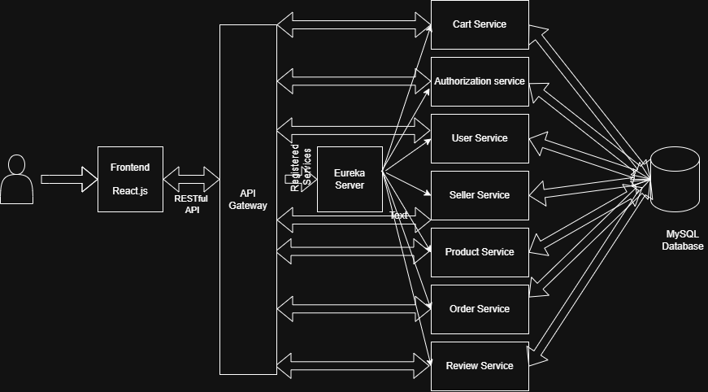
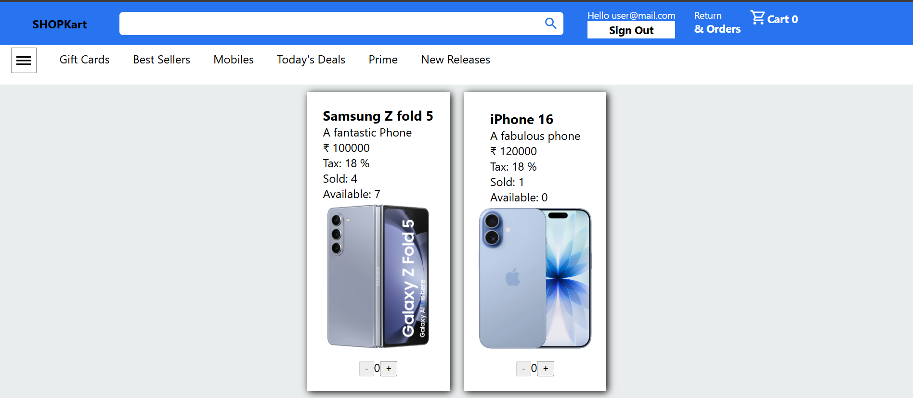

# E-Commerce Microservices Platform

## Overview

This project is a microservices-based e-commerce application developed using React and Spring Boot. The system follows a distributed architecture where individual services handle specific business functionalities such as user management, product management, authentication, and order processing.

## Tech Stack

### Frontend

* React
* JavaScript
* Axios
* Bootstrap/Tailwind CSS

### Backend

* Spring Boot
* Spring Security
* Hibernate/JPA
* Spring Cloud Gateway
* Eureka Discovery Server
* MySQL

### Tools

* Git
* GitHub
* Maven

## Architecture

## Landing Page

## Eureka Server

## Microservices

### Eureka Server

Acts as the service registry where all microservices register themselves.

### API Gateway

Provides a single entry point for all client requests and routes requests to appropriate services.

### Authentication Service

Handles user registration, login, and security-related operations.

### User Service

Manages user information and profile data.

### Product Service

Handles product catalog operations including adding, updating, and retrieving products.

### Order Service

Processes customer orders and order history.

## How to Run the Project

### Prerequisites

* Java 17+
* Maven
* Node.js
* MySQL

### Step 1: Start MySQL

Create the required databases and update database credentials in each service's application.properties file.

### Step 2: Start Eureka Server

Navigate to the Eureka Server project directory:

mvn spring-boot:run

Wait until Eureka Dashboard becomes available.

### Step 3: Start API Gateway

Navigate to API Gateway directory:

mvn spring-boot:run

### Step 4: Start Backend Services

Run the services one by one:

1. Authentication Service
2. User Service
3. Product Service
4. Order Service

For each service:

mvn spring-boot:run

Verify that all services are registered in Eureka Dashboard.

### Step 5: Start React Frontend

Navigate to frontend directory:

npm install

npm start

Frontend will start on localhost:3000.

## Features

* User Authentication
* Product Listing
* Product Search
* Order Management
* Service Discovery using Eureka
* API Routing using Spring Cloud Gateway
* Secure APIs using Spring Security
* Database Integration using Hibernate/JPA
* Usage of swagger-ui/OpenAPI for API testing
* Docker Containerization (files).

## Future Improvements

* Redis Caching
* Kafka Event Streaming
* Kubernetes Deployment
* CI/CD using GitHub Actions
* AI-Based Product Recommendation System
